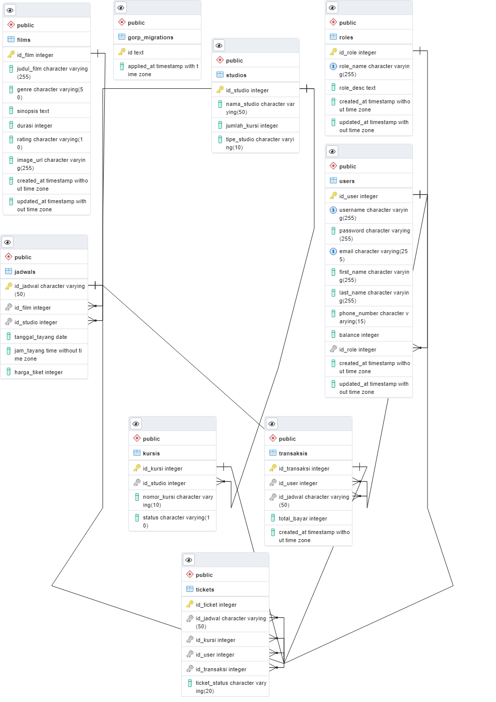

<a name="readme-top"></a>

<!-- PROJECT SHIELDS -->
[![LinkedIn][linkedin-shield]][linkedin-url]


<!-- PROJECT LOGO -->
<br />
<div align="center">
  <a href="https://github.com/RickyIG/home-cinema">
    
  </a>

  <h3 align="center"Home Cinema API</h3>

  <p align="center">
    Home Cinema API
    <br />
    <a href="https://github.com/RickyIG/home-cinema"><strong>Explore the project »</strong></a>
    <br />
    <br />
    <a href="https://quiz-3-golang-production.up.railway.app/categories/1/books">View Demo</a>
    ·
    <a href="https://github.com/RickyIG/home-cinema/issues/new?labels=bug&template=bug-report---.md">Report Bug</a>
    ·
    <a href=https://github.com/RickyIG/home-cinema/issues/new?labels=enhancement&template=feature-request---.md">Request Feature</a>
  </p>
</div>


<!-- TABLE OF CONTENTS -->
<details>
  <summary>Table of Contents</summary>
  <ol>
    <li>
      <a href="#about-the-project">About The Project</a>
      <ul>
        <li><a href="#built-with">Built With</a></li>
      </ul>
    </li>
    <li>
      <a href="#getting-started">Getting Started</a>
      <ul>
        <li><a href="#prerequisites">Prerequisites</a></li>
        <li><a href="#installation">Installation</a></li>
      </ul>
    </li>
    <li><a href="#usage">Usage</a></li>
    <li><a href="#roadmap">Roadmap</a></li>
    <li><a href="#contributing">Contributing</a></li>
    <li><a href="#license">License</a></li>
    <li><a href="#contact">Contact</a></li>
  </ol>
</details>


<!-- ABOUT THE PROJECT -->
## About The Project

Sistem API Home Cinema hadir sebagai solusi komprehensif untuk mengoptimalkan pengelolaan berbagai aspek operasional bioskop. Dibangun dengan teknologi modern, sistem ini menawarkan berbagai fitur yang bermanfaat bagi pengelola bioskop untuk meningkatkan efisiensi dan efektivitas dalam menjalankan bisnisnya.

Keunggulan utama Sistem API Home Cinema terletak pada kemampuannya untuk mengelola berbagai elemen penting dalam operasional bioskop. Pengelola dapat dengan mudah menambah, memperbarui, dan menghapus informasi film yang ditayangkan, termasuk detail seperti judul, sutradara, genre, dan durasi. Sistem ini juga memungkinkan pengelola untuk memantau dan mengelola daftar studio, termasuk informasi kapasitas, layout kursi, dan jadwal penayangan film.

Lebih lanjut, Sistem API Home Cinema dilengkapi dengan fitur manajemen transaksi dan tiket yang terintegrasi. Pengelola dapat memproses transaksi pembelian tiket secara efisien, melacak data penjualan, dan mengelola riwayat tiket yang telah dibeli oleh para pengunjung. Fitur-fitur ini membantu pengelola dalam memberikan layanan terbaik bagi para pengunjung dan meningkatkan pendapatan bioskop.

Dengan desain yang user-friendly dan skalabilitas yang tinggi, Sistem API Home Cinema dapat disesuaikan dengan kebutuhan bioskop yang berbeda. Sistem ini dapat diintegrasikan dengan aplikasi lain seperti aplikasi mobile untuk pembelian tiket atau website bioskop, sehingga memberikan kemudahan dan kenyamanan bagi para pengunjung.

Sistem API Home Cinema merupakan solusi ideal bagi pengelola bioskop yang ingin meningkatkan efisiensi dan efektivitas dalam menjalankan bisnisnya. Dengan fitur-fitur yang lengkap dan terintegrasi, sistem ini membantu pengelola untuk memberikan layanan terbaik bagi para pengunjung dan meningkatkan keuntungan bioskop.

<p align="right">(<a href="#readme-top">back to top</a>)</p>


### Built With

Dibangun dengan:
[![Go][Golang]][Go-url]

<p align="right">(<a href="#readme-top">back to top</a>)</p>


<!-- GETTING STARTED -->
## Getting Started

This is an example of how you may give instructions on setting up your project locally.
To get a local copy up and running follow these simple example steps.

### Prerequisites

This is an example of how to list things you need to use the software and how to install them.
* Go 1.22.1
* Postman

### Installation

_Below is an example of how you can instruct your audience on installing and setting up your app. This template doesn't rely on any external dependencies or services._

1. Clone the repo (if needed)
   ```sh
   git clone https://github.com/RickyIG/home-cinema.git
   ```
2. Buka Postman
3. Lakukan pemanggilan Rest API via Postman

Berikut link yang telah di-deploy:
(https://home-cinema-production.up.railway.app/)

<p align="right">(<a href="#readme-top">back to top</a>)</p>

<!-- ERD -->
## Entity-Relationship Diagram (ERD)

<div align="center">
  <a href="https://github.com/RickyIG/home-cinema">
    
  </a>
</div>

<!-- USAGE EXAMPLES -->
## Usage

### User Roles
Predefined roles.
- **Role ID 1:** user
- **Role ID 2:** admin
- **Role ID 3:** fintech


### Manajemen User

#### POST Register User
- Endpoint: `https://home-cinema-production.up.railway.app/api/register/user`
- Deskripsi: Endpoint ini memungkinkan pengguna dengan hak user untuk mendaftarkan user baru. (Permintaan POST)
- Notes:
  - Panjang password harus minimal panjangnya 8 character, harus memuat setidaknya 1 special character, 1 lowercase, 1 uppercase, dan 1 angka
  - Email harus valid
  - username, email, dan phone_number harus unique
- Contoh Input Raw Body (JSON):
  ```json
  {
    "username": "Test12345#",
    "password": "Test12345#",
    "first_name": "Test",
    "last_name" : "Test",
    "email": "test@gmail.com",
    "phone_number": "082839128762"
  }


#### POST Register Admin
- Endpoint: `https://home-cinema-production.up.railway.app/api/register/admin`
- Deskripsi : Endpoint ini memungkinkan pengguna dengan hak istimewa admin untuk mendaftarkan admin baru. (Permintaan POST)
- Notes:
  - Panjang password harus minimal panjangnya 8 character, harus memuat setidaknya 1 special character, 1 lowercase, 1 uppercase, dan 1 angka
  - Email harus valid
  - username, email, dan phone_number harus unique
- Contoh Input Raw Body (JSON):
  ```json
  {
    "username": "rickyindrag",
    "password": "Kocak@12345",
    "first_name": "Ricky Indra",
    "last_name" : "Gunawan",
    "email": "rickyindra53@gmail.com",
    "phone_number": "082317880077"
  }


#### POST Register Fintech
- Endpoint: `https://home-cinema-production.up.railway.app/api/register/fintech`
- Deskripsi: Endpoint ini memungkinkan pengguna dengan hak istimewa fintech untuk mendaftarkan fintech baru. (Permintaan POST)
- Notes:
  - Panjang password harus minimal panjangnya 8 character, harus memuat setidaknya 1 special character, 1 lowercase, 1 uppercase, dan 1 angka
  - Email harus valid
  - username, email, dan phone_number harus unique
- Contoh Input Raw Body (JSON):
  ```json
  {
    "username": "Fintech@12345",
    "password": "Fintech@12345",
    "first_name": "Fin",
    "last_name" : "Tech",
    "email": "fintech@gmail.com",
    "phone_number": "0823560934"
  }


#### POST Login
- Endpoint: `https://home-cinema-production.up.railway.app/api/login`
- Deskripsi: Endpoint ini menangani login pengguna dan mengembalikan token autentikasi setelah login berhasil. (Permintaan POST)
- Contoh Input Raw Body (JSON):
  ```json
  {
      "username": "rickyindrag",
      "password": "Kocak@12345"
  }
  
#### GET User Profile
- Endpoint: `https://home-cinema-production.up.railway.app/api/user/profile`
- Deskripsi: Endpoint ini mengambil informasi profil user. Memerlukan autentikasi user dengan JWT (JSON Web Token) dan pemeriksaan role (middleware.JWTAuth(1) menunjukkan role user). (Permintaan GET)
- Authorization: Bearer Token
- Token: ```<token>```


#### GET Admin Profile
- Endpoint: `https://home-cinema-production.up.railway.app/api/admin/profile`
- Deskripsi: Endpoint ini mengambil informasi profil admin. Memerlukan autentikasi admin dengan JWT (JSON Web Token) dan pemeriksaan role (middleware.JWTAuth(2) menunjukkan role admin). (Permintaan GET)
- Authorization: Bearer Token
- Token: ```<token>```

#### GET Fintech Profile
- Endpoint: `https://home-cinema-production.up.railway.app/api/fintech/profile`
- Deskripsi: Endpoint ini mengambil informasi profil fintech. Memerlukan autentikasi fintech dengan JWT (JSON Web Token) dan pemeriksaan role (middleware.JWTAuth(3) menunjukkan role fintech). (Permintaan GET)
- Authorization: Bearer Token
- Token: ```<token>```


#### PUT Top Up oleh Fintech
- Endpoint: `https://home-cinema-production.up.railway.app/api/fintech/addbalance/user/:id_user`
- Deskripsi: Endpoint ini memungkinkan pihak ketiga (penyedia layanan keuangan) untuk menambah saldo pengguna. ID pengguna diperoleh dari parameter URL :id_user. Perhatikan bahwa endpoint ini memerlukan autentikasi JWT dengan level 3, yang kemungkinan ditujukan khusus untuk peran penyedia layanan keuangan (fintech).
- Note:
  - Metodenya adalah penambahan balance user saat ini + balance yang diinput
- Authorization: Bearer Token
- Token: ```<token>```
- Contoh input Raw Body (JSON):
  ```json
  {
      "balance": 150000
  }


### Manajemen Film

#### GET All Films
- Endpoint: `https://home-cinema-production.up.railway.app/films`
- Deskripsi: Mengambil daftar semua film yang saat ini ada di sistem. (Permintaan GET)

#### GET Film by ID Film
- Endpoint: `https://home-cinema-production.up.railway.app/films/:id_film`
- Deskripsi: Mengambil informasi tentang film tertentu berdasarkan ID-nya di parameter URL. (Permintaan GET)

#### POST Insert Film
- Endpoint: `https://home-cinema-production.up.railway.app/films`
- Deskripsi: Mengizinkan admin untuk membuat entri film baru. Memerlukan autentikasi admin (middleware.JWTAuth(2)). (Permintaan POST)
- Notes:
  - Semua harus diisi.
- Authorization: Bearer Token
- Token: ```<token>```
- Contoh Input Raw Body (JSON):
  ```json
  {
    "judul_film": "Meraih Mimpi",
    "genre": "Drama",
    "sinopsis": "Ayu, seorang gadis desa yang memiliki cita-cita besar untuk menjadi seorang penari. Ia harus menghadapi berbagai rintangan dan perjuangan untuk meraih mimpinya tersebut.",
    "durasi": 120,
    "rating": "R",
    "image_url": "https://www.example.com/test.jpg"
}

#### PUT Update Film
- Endpoint: `https://home-cinema-production.up.railway.app/films/:id_film`
- Deskripsi: Mengizinkan admin untuk memperbarui entri film yang ada. Memerlukan autentikasi admin (middleware.JWTAuth(2)). (Permintaan PUT)
- Authorization: Bearer Token
- Token: ```<token>```
- Contoh input Raw Body (JSON):
  ```json
  {
    "judul_film": "The Dark Knight",
    "genre": "Action, Thriller",
    "sinopsis": "With the help of Batman, Lieutenant James Gordon and District Attorney Harvey Dent fight crime in Gotham City. But the arrival of The Joker throws their already fragile world into chaos, forcing Batman to face the ultimate test.",
    "durasi": 152,
    "rating": "D",
    "image_url": "https://https://www.example.com/Dark-Knight-Movie-Poster.png"
}

#### DELETE Delete Film
- Endpoint: `https://home-cinema-production.up.railway.app/films/:id_film`
- Deskripsi: Mengizinkan admin untuk menghapus entri film. Memerlukan autentikasi admin (middleware.JWTAuth(2)). (Permintaan DELETE)
- Authorization: Bearer Token
- Token: ```<token>```


### Manajemen Studio

#### GET All Studios
- Endpoint: `https://home-cinema-production.up.railway.app/studios`
- Deskripsi: Mengambil daftar semua studio di sistem. (Permintaan GET)

#### GET Studio by ID Studio
- Endpoint: `https://home-cinema-production.up.railway.app/studios/:id_studio`
- Deskripsi: Mengambil informasi tentang studio tertentu berdasarkan ID-nya. (Permintaan GET)

#### POST Insert Studio
- Endpoint: `https://home-cinema-production.up.railway.app/studios`
- Deskripsi: Mengizinkan admin untuk membuat entri studio baru. Memerlukan autentikasi admin (middleware.JWTAuth(2)). (Permintaan POST)
- Notes:
  - Semua harus diisi.
  - Tipe studio bisa diisi 2D, 3D atau IMAX (optional, value tidak harus sama tapi tetap harus diisi)
- Authorization: Bearer Token
- Token: ```<token>```
- Contoh Input Raw Body (JSON):
  ```json
  {
    "nama_studio": "Studio 1",
    "jumlah_kursi": 8,
    "tipe_studio" : "2D"
  }

#### PUT Update Studio
- Endpoint: `https://home-cinema-production.up.railway.app/studios/:id_studio`
- Deskripsi:  Mengizinkan admin untuk memperbarui entri studio yang ada. Memerlukan autentikasi admin (middleware.JWTAuth(2)). (Permintaan PUT)
- Authorization: Bearer Token
- Token: ```<token>```
- Contoh input Raw Body (JSON):
  ```json
  {
    "nama_studio": "Studio 1",
    "jumlah_kursi": 8,
    "tipe_studio" : "IMAX"
  }

#### DELETE Delete Studio
- Endpoint: `https://home-cinema-production.up.railway.app/studios/:id_studio`
- Deskripsi: Mengizinkan admin untuk menghapus entri studio. Memerlukan autentikasi admin (middleware.JWTAuth(2)). (Permintaan DELETE)
- Authorization: Bearer Token
- Token: ```<token>```


### Manajemen Kursi

Catatan : 
- POST Insert Kursi, PUT Update Kursi, dan DELETE Delete Kursi jarang digunakan karena akan ada proses automasi dari pembuatan Jadwal.
- Perhatikan foreign key pada ERD.

#### GET All Kursis
- Endpoint: `https://home-cinema-production.up.railway.app/studios/:id_studio/seats`
- Deskripsi: Mengambil daftar semua kursi untuk studio tertentu berdasarkan ID-nya. (Permintaan GET)

#### GET Kursi by ID Kursi
- Endpoint: `https://home-cinema-production.up.railway.app/studios/:id_studio/seats/:id_kursi`
- Deskripsi: Mengambil informasi tentang kursi tertentu dalam studio, diidentifikasi oleh ID studio dan ID kursi di parameter URL. Memerlukan autentikasi pengguna (middleware.JWTAuth(1)). (Permintaan GET)
- Authorization: Bearer Token
- Token: ```<token>``` 

#### POST Insert Kursi
- Endpoint: `https://home-cinema-production.up.railway.app/studios/:id_studio/seats`
- Deskripsi: Mengizinkan admin untuk membuat kursi baru untuk studio. Memerlukan autentikasi admin (middleware.JWTAuth(2)). (Permintaan POST)
- Notes:
  - Semua harus diisi.
- Authorization: Bearer Token
- Token: ```<token>```
- Contoh Input Raw Body (JSON):
  ```json
  {
    "nomor_kursi": "A-1"
  }
  
#### PUT Update Kursi
- Endpoint: `https://home-cinema-production.up.railway.app/studios/:id_studio/seats/:id_kursi`
- Deskripsi:  Mengizinkan admin untuk memperbarui kursi yang ada untuk studio. Memerlukan autentikasi admin (middleware.JWTAuth(2)). (Permintaan PUT)
- Authorization: Bearer Token
- Token: ```<token>```
- Contoh input Raw Body (JSON):
  ```json
  {
    "nomor_kursi": "A-2"
  }

#### DELETE Delete Kursi
- Endpoint: `https://home-cinema-production.up.railway.app/studios/:id_studio/seats/:id_kursi`
- Deskripsi: Mengizinkan admin untuk menghapus kursi studio. Memerlukan autentikasi admin (middleware.JWTAuth(2)). (Permintaan DELETE)
- Authorization: Bearer Token
- Token: ```<token>```


### Manajemen Jadwal

Catatan : 
- PUT Update Jadwal dan DELETE Delete Jadwal jarang digunakan dalam proses bisnis.
- Perhatikan foreign key pada ERD.

#### GET All Jadwals
- Endpoint: `https://home-cinema-production.up.railway.app/jadwal`
- Deskripsi: Mengambil daftar semua jadwal film (kemungkinan termasuk informasi film, studio, dan waktu tayang). (Permintaan GET)

#### GET Jadwal by ID Jadwal
- Endpoint: `https://home-cinema-production.up.railway.app/jadwal/:id_jadwal`
- Deskripsi: Mengambil informasi tentang entri jadwal tertentu berdasarkan ID-nya. Memerlukan autentikasi pengguna (middleware.JWTAuth(1)). (Permintaan GET)
- Authorization: Bearer Token
- Token: ```<token>``` 

#### POST Insert Jadwal
- Endpoint: `https://home-cinema-production.up.railway.app/jadwal`
- Deskripsi: Mengizinkan admin untuk membuat entri jadwal film baru. Memerlukan autentikasi admin (middleware.JWTAuth(2)). (Permintaan POST)
- Notes:
  - Semua harus diisi.
  - API ini akan secara otomatis melakukan POST Kursi sesuai dengan jumlah_kursi dalam tabel Studio
  - Perhatikan pada contoh input raw body (JSON).
    - tanggal_tayang = Tanggal film tayang, yang diutamakan adalah data YYYY-MM-DD, meskipun cara inputnya harus sesuai format ["2024-04-25T00:00:00Z"]
    - jam_tayang = Jam film tayang, yang diutamakan adalah data hh:mm:ss, meskipun cara inputnya harus sesuai format ["2024-04-25T17:30:00Z"]
- Authorization: Bearer Token
- Token: ```<token>```
- Contoh Input Raw Body (JSON):
  ```json
  {
    "id_film" : 1,
    "id_studio": 1,
    "tanggal_tayang": "2024-04-25T00:00:00Z",
    "jam_tayang": "2024-04-25T17:30:00Z",
    "harga_tiket": 50000
}
  
#### PUT Update Jadwal
- Endpoint: `https://home-cinema-production.up.railway.app/jadwal/:id_jadwal`
- Deskripsi:  Mengizinkan admin untuk memperbarui entri jadwal yang ada. Memerlukan autentikasi admin (middleware.JWTAuth(2)). (Permintaan PUT)
- Notes:
  - tanggal_tayang dan jam_tayang harus sama seperti sebelum dilakukan pengubahan
- Authorization: Bearer Token
- Token: ```<token>```
- Contoh input Raw Body (JSON):
  ```json
  {
    "id_film" : 1,
    "id_studio": 1,
    "tanggal_tayang": "2024-04-25T00:00:00Z",
    "jam_tayang": "2024-04-25T17:30:00Z",
    "harga_tiket": 45000
}

#### DELETE Delete Jadwal
- Endpoint: `https://home-cinema-production.up.railway.app/jadwal/:id_jadwal`
- Deskripsi: Mengizinkan admin untuk menghapus entri jadwal. Memerlukan autentikasi admin (middleware.JWTAuth(2)). (Permintaan DELETE)
- Authorization: Bearer Token
- Token: ```<token>```


### Transaksi

Catatan : 
- Disinilah Endpoint Transaksi berlangsung.

#### POST Pesan Tiket (Melakukan Transaksi)
- Endpoint: `https://home-cinema-production.up.railway.app/jadwal/:id_jadwal/transactions`
- Deskripsi: Endpoint ini memungkinkan pengguna untuk membuat transaksi (mungkin untuk pembelian tiket) untuk jadwal tertentu. ID jadwal tersebut diperoleh dari parameter URL :id_jadwal. Memerlukan autentikasi user (middleware.JWTAuth(1)). (Permintaan POST)
- Notes:
  - Semua harus diisi.
  - Endpoint ini mampu menerima lebih dari 1 tiket.
  - API ini dapat memproses:
    - Mengecek kursi tersedia/tidak.
    - Melakukan POST ticket otomatis.
    - Terdapat sistem balance, sehingga jika berhasil maka balance user terpotong.
  - Perhatikan pada contoh input raw body (JSON).
    - transactionData sengaja dikosongkan karena data-datanya sudah didapatkan dari Param dan Token. Anggaplah user sedang melihat jadwal kemudian ingin memesan
    - IDKursi = Sesuaikan dengan data di tabel Kursi
- Authorization: Bearer Token
- Token: ```<token>```
- Contoh Input Raw Body (JSON):
  ```json
  {
  "transactionData": {},
  "Tickets": [
    {
      "IDKursi": 2
    },
    {
      "IDKursi": 3
    }
  ]
  }

#### GET GetUserTransactionHistory
- Endpoint: `https://home-cinema-production.up.railway.app/transactions`
- Deskripsi: Endpoint ini mengambil riwayat transaksi pengguna, berisi detail pembelian dan tiket. Jika field bersifat foreign key, maka value field berisikan ID dari foreign key tersebut. Memerlukan autentikasi user (middleware.JWTAuth(1)). (Permintaan POST)
- Authorization: Bearer Token
- Token: ```<token>``` 

#### GET GetUserTransactionHistory By Transaction ID
- Endpoint: `https://home-cinema-production.up.railway.app/transactions/:id_transaksi`
- Deskripsi: Endpoin ini mengambil informasi tentang transaksi tertentu berdasarkan ID transaksinya, yang diperoleh dari parameter URL :id_transaksi. Jika field bersifat foreign key, maka value field berisikan ID dari foreign key tersebut. Memerlukan autentikasi user (middleware.JWTAuth(1)). (Permintaan POST)
- Authorization: Bearer Token
- Token: ```<token>```

#### GET GetUserTransactionHistory By Transaction ID
- Endpoint: `https://home-cinema-production.up.railway.app/transactions/:id_transaksi/details`
- Deskripsi: Endpoint ini mengambil informasi lebih detail tentang transaksi tertentu berdasarkan ID transaksinya, yang diperoleh dari parameter URL :id_transaksi.  Detail yang diberikan lebih lengkap dibandingkan dengan endpoint sebelumnya. Jika field bersifat foreign key, maka akan menampilkan keseluruhan field dari tabel foreign key tersebut. Memerlukan autentikasi user (middleware.JWTAuth(1)). (Permintaan POST)
- Authorization: Bearer Token
- Token: ```<token>```


### Tiket


<p align="right">(<a href="#readme-top">back to top</a>)</p>


<!-- ROADMAP -->
## Roadmap

- [x] Setup project
- [x] Pembuatan API
  - [x] User
    - [x] Auth
      - [x] Register, Login (+ JWT, Role-Based)
    - [x] See Profile
    - [x] Put Balance oleh Fintech
  - [x] CRUD
    - [x] Film
    - [x] Studio
    - [x] Jadwal
  - [x] Special Case di luar CRUD
    - [x] Kursi
      - [x] Tersedia/Tidak Tersedia
      - [x] Auto-Add dari Jadwal 
  - [x] Pesan Ticket (Melakukan Transaksi)
  - [x] Transaksi
    - [x] GetUserTransactionHistory
    - [x] GetUserTransactionHistoryByID
    - [x] GetUserTransactionHistoryDetail
  - [x] Ticket
    - [x] GetUserTicketHistory
    - [x] GetUserTicketHistoryByTransactionID
    - [x] GetUserTicketHistoryByIDs (by transaction ID + ticket ID)
- [x] Deploy to Railway

See the [open issues](https://github.com/RickyIG/quiz-3-golang/issues) for a full list of proposed features (and known issues).

<p align="right">(<a href="#readme-top">back to top</a>)</p>


<!-- CONTRIBUTING -->
## Contributing

Contributions are what make the open source community such an amazing place to learn, inspire, and create. Any contributions you make are **greatly appreciated**.

If you have a suggestion that would make this better, please fork the repo and create a pull request. You can also simply open an issue with the tag "enhancement".
Don't forget to give the project a star! Thanks again!

1. Fork the Project
2. Create your Feature Branch (`git checkout -b feature/AmazingFeature`)
3. Commit your Changes (`git commit -m 'Add some AmazingFeature'`)
4. Push to the Branch (`git push origin feature/AmazingFeature`)
5. Open a Pull Request

<p align="right">(<a href="#readme-top">back to top</a>)</p>


<!-- LICENSE -->
## License

Apache 2.0 License.

<p align="right">(<a href="#readme-top">back to top</a>)</p>


<!-- CONTACT -->
## Contact

Ricky Indra Gunawan - Instagram: [@rickyindrag](https://instagram.com/rickyindrag) - rickyindra53@gmail.com

Project Link: [https://github.com/RickyIG/home-cinema](https://github.com/RickyIG/home-cinema)

<p align="right">(<a href="#readme-top">back to top</a>)</p>


<!-- MARKDOWN LINKS & IMAGES -->
<!-- https://www.markdownguide.org/basic-syntax/#reference-style-links -->
[linkedin-shield]: https://img.shields.io/badge/-LinkedIn-black.svg?style=for-the-badge&logo=linkedin&colorB=555
[linkedin-url]: https://linkedin.com/in/rickyindrag
[product-screenshot]: images/screenshot.png
[Golang]: https://go.dev/blog/go-brand/Go-Logo/PNG/Go-Logo_Blue.png
[Go-url]: https://go.dev/
[Laravel.com]: https://img.shields.io/badge/Laravel-FF2D20?style=for-the-badge&logo=laravel&logoColor=white
[Laravel-url]: https://laravel.com
[Bootstrap.com]: https://img.shields.io/badge/Bootstrap-563D7C?style=for-the-badge&logo=bootstrap&logoColor=white
[Bootstrap-url]: https://getbootstrap.com
[JQuery.com]: https://img.shields.io/badge/jQuery-0769AD?style=for-the-badge&logo=jquery&logoColor=white
[JQuery-url]: https://jquery.com 
